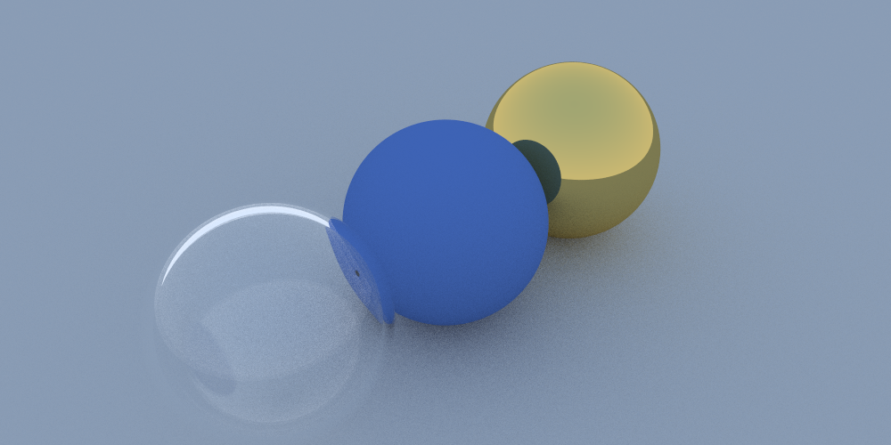

# Renderer

The goal of this was to learn both rendering, maths and computer graphics.

# Building 

Use vcpkg and install glm.
Next, build with cmake.

# Planned 

- Importance Sampling / Multiple Importance Sampling
- BxDFs
- Texture system 
- Small procedural texturing language
- Adaptive sampling
- Improve overall performance of the renderer
- GPU support

### Showcase
* Sample 1
  